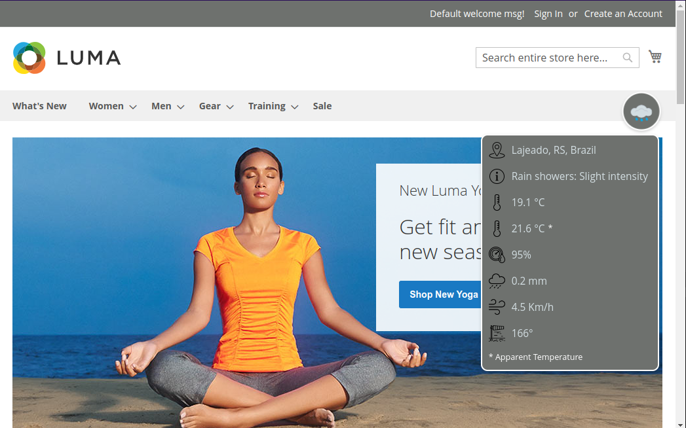
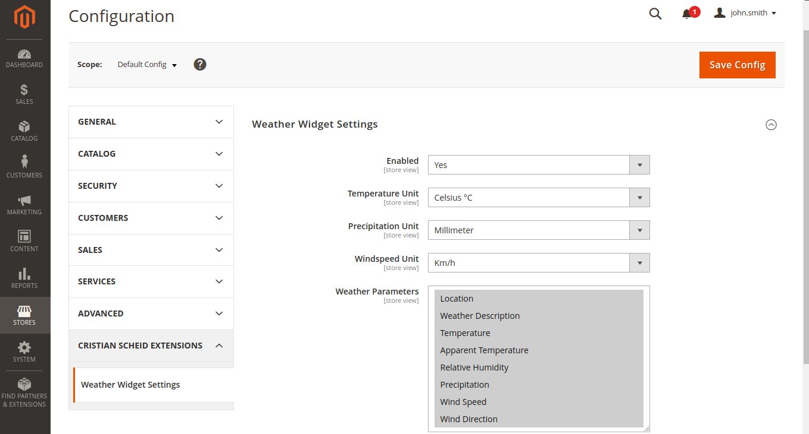

# Magento 2 - Weather Widget

## Description

The Weather Widget module seamlessly integrates real-time weather data into Magento 2 applications, enhancing the user experience with an elegant, customizable display. Using external APIs to fetch weather details based on visitors' IP addresses, it provides immediate, accurate updates with dynamic icons that reflect current conditions. Efficient caching optimizes performance, reducing API calls and ensuring uninterrupted weather updates.

### Features

- Auto-refreshing weather display with updates every 15 minutes.
- Dynamic weather icons reflecting current conditions.
- Customizable settings for units and displayed parameters.
- Dual caching mechanism (server and client-side) to optimize performance and reduce API requests.
- Integration with IP-based geolocation and weather data APIs.

## Built With

![PHP][php-badge]
![Magento][magento-badge]
![MySQL][mysql-badge]

![JavaScript][javascript-badge]
![CSS][css-badge]

## Visuals




## Installation

To get started with this project, follow the steps below:

1.  **Clone the repository**

    ```
    git clone https://github.com/cristianscheid/magento2-weather-widget.git
    ```

2.  **Copy files to the Magento directory**

    - After cloning, you’ll have a folder named `magento2-weather-widget`.
    - Copy its contents to the following directory in your Magento installation:

      ```
      <Magento_Root_Directory>/app/code/CristianScheid/WeatherWidget/
      ```

    > Replace `<Magento_Root_Directory>` with the path to your Magento installation root directory. You will need to create the `CristianScheid/WeatherWidget/` directory.

3.  **Module activation**

    - From the root directory of your Magento installation, run:

      ```
      bin/magento setup:upgrade &&
      bin/magento setup:di:compile &&
      bin/magento setup:static-content:deploy -f &&
      bin/magento c:c && bin/magento c:f
      ```

    - After that, the module should be activated and ready to use.

## Usage

To configure the module, navigate to the store's admin panel and access:

```
Stores > Configuration > Cristian Scheid Extensions > Weather Widget Settings
```

You should see something like this:



1. Enable the module by setting `Enabled` to `Yes`.
2. Coose your preferred measurement units and select the parameters to display on the widget.
3. Click `Save Config` to apply your settings.

Finally, go to the frontend of your Magento store and refresh the page to see the Weather Widget in action.

The Weather Widget is shown on the following pages within Magento 2:

- CMS Homepage (`cms_index_index`)
- Product View Page (`catalog_product_view`)
- Category View Page (`catalog_category_view`)
- Catalog Search Results Page (`catalogsearch_result_index`)

### Data Update Mechanism

The widget updates its data every 15 minutes using a dual caching mechanism for enhanced performance:

- **Server Side:** Captures the visitor's IP address and queries both geolocation and weather APIs, caching their responses to reduce server load. Geolocation API responses are cached for 24 hours, while weather data is refreshed every 15 minutes.

- **Client Side:** Uses browser local storage to store the API response from the Magento custom REST API, updating this data every 15 minutes. If users clear their local storage or switch browsers, the backend retains previously stored responses, ensuring seamless access to weather data without repeated API calls.

When data is updated, there’s no need to refresh the browser, allowing users to access the latest weather information automatically.

## License

Distributed under the MIT License. See LICENSE.txt for more information.

### Usage Restrictions

This project utilizes the following APIs, which are free for non-commercial use only:

- [IP-API](https://ip-api.com/docs/) (for geolocation based on IP)
- [Open-Meteo API](https://open-meteo.com/en/docs) (for weather data)

While this code is licensed under the MIT License and can be used for any purpose, please note that the integrated APIs are free only for non-commercial use. If you wish to use these APIs for commercial purposes, a paid subscription is required. Therefore, any application or service developed with this project must not use these APIs commercially unless you have adapted the code to work with their paid versions.

<!-- Badges for 'Built With' section -->

[php-badge]: https://img.shields.io/badge/PHP-8.3-gray?style=for-the-badge&logo=php&logoColor=white
[magento-badge]: https://img.shields.io/badge/Magento-2.4.7-gray?style=for-the-badge&logo=data:image/svg+xml;base64,PHN2ZyB4bWxucz0iaHR0cDovL3d3dy53My5vcmcvMjAwMC9zdmciIHZpZXdCb3g9IjAgMCAyNCAyNCIgeG1sbnM6dj0iaHR0cHM6Ly92ZWN0YS5pby9uYW5vIj48cGF0aCBkPSJNMTIgMjRsLTQuNDU1LTIuNTcydi0xMmwyLjk3LTEuNzE1djEyLjAwMWwxLjQ4NS45MDIgMS40ODUtLjkwMlY3LjcxM2wyLjk3MSAxLjcxNXYxMkwxMiAyNHpNMjIuMzkxIDZ2MTJsLTIuOTY5IDEuNzE0VjcuNzEzTDEyIDMuNDMgNC41NzQgNy43MTN2MTIuMDAxTDEuNjA5IDE4VjZMMTIgMGwxMC4zOTEgNnoiIGZpbGw9IiNmZmYiLz48L3N2Zz4=
[mysql-badge]: https://img.shields.io/badge/MySQL-8.0-gray?style=for-the-badge&logo=mysql&logoColor=white
[javascript-badge]: https://img.shields.io/badge/JavaScript-ES6-gray?style=for-the-badge&logo=javascript&logoColor=white
[css-badge]: https://img.shields.io/badge/CSS-CSS3-gray?style=for-the-badge&logo=css3&logoColor=white
